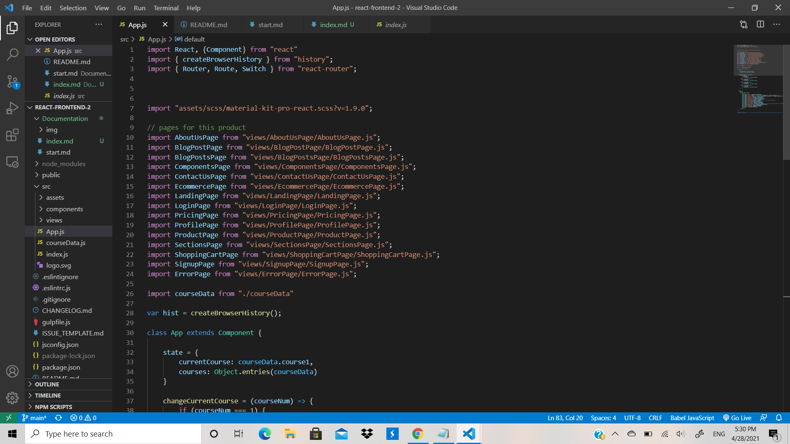

# Welcome to Index.md

So to start off not really much goes on in this file, really all that goes on is adding the react app to the the html file, making this an SPA (single page application), just basic react stuff.

## Please proceed to /src/App.js

So you're screen should look like this

Now scroll down to render() method of the app. Now here is where the majority of the app lives and this is where knowledge of React-Router will be very beneficial. Now every single pre-built page that comes with the component library is still there but the ones we have modded/configured for this project have a JSX comment next to them that should look like this `{/* Specific Code Comment */}`.

Within the routes will be the specific component rendered for example `<Route path="/about-us" component={AboutUsPage} /> {/* About us page */}` the component rendered is the AboutUsPage where it says component={}. These specific components can be found in the views directory and each prebuilt page will have its own respective directory

- Views
    - AboutUsPage
        - AboutUsPage.js (Component being rendered)
        - Sections (components that build the AboutUsPage component)
            - Description.js
            - Services.js
            - Team.js
    - BlogPostPage
        - BlogPostPage.js
        - Sections
            - Text.js

From there it will be up to you to configure these components to the way that you want them, I could write down an explanation on how all the JSX and styling works in these components but that would take a very long time, as long as you understand JSX and how components work, you should be able to work with these components just fine.

Another thing about these routes, you may notice these two routes

`<Route path="/course" render={()=> <BlogPostPage courseData={this.state.currentCourse} />} /> {/* Specific Course Page*/}
<Route path="/courses" render={()=> <BlogPostsPage changeCurrentCourse={this.changeCurrentCourse} courses={this.state.courses} />} /> {/* Course Catalog Page */}`

these two routes are dynamic or at least the course one is but they both have data passed data passed down to the component through props and this data lives within the App state, This is where being comfortable with React props and state is very important

I will mention one last thing that is very important here, You may have noticed the courseData import, the state object and the changeCurrentCourse method that look like this

`
import courseData from "./courseData"

var hist = createBrowserHistory();

class App extends Component {

    state = {
        currentCourse: courseData.course1,
        courses: Object.entries(courseData)
    }

    changeCurrentCourse = (courseNum) => {
        if (courseNum === 1) {
            this.setState({
                currentCourse: courseData.course1
            })
        } else if (courseNum === 2) {
            this.setState({
                currentCourse: courseData.course2
            })
        } else if (courseNum === 3) {
            this.setState({
                currentCourse: courseData.course3
            })
        } else if (courseNum === 4) {
            this.setState({
                currentCourse: courseData.course4
            })
        }
    }
`

## Please proceed to state.md to learn more about this